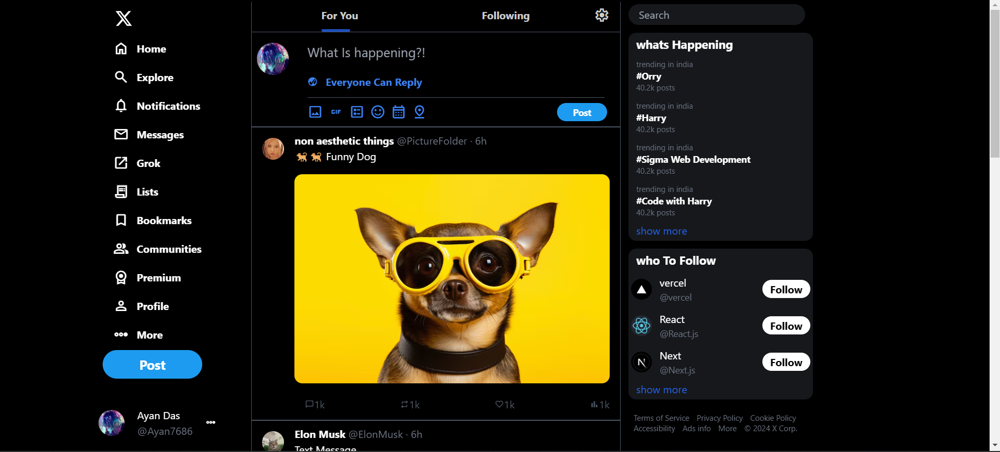
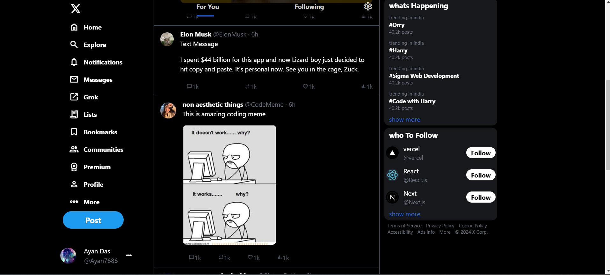
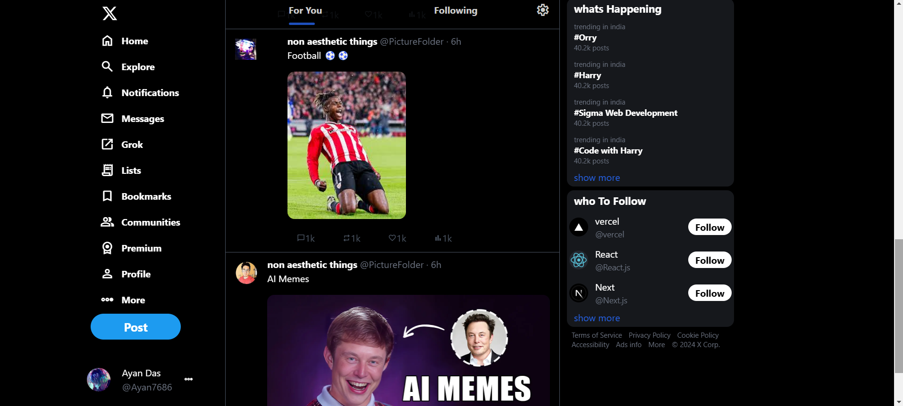
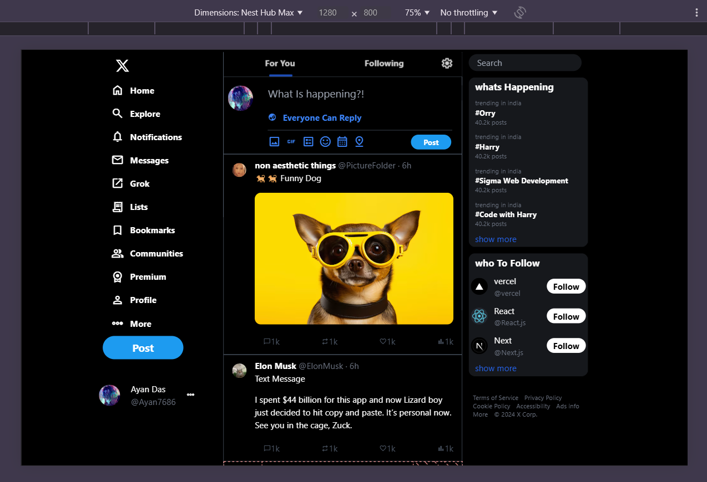
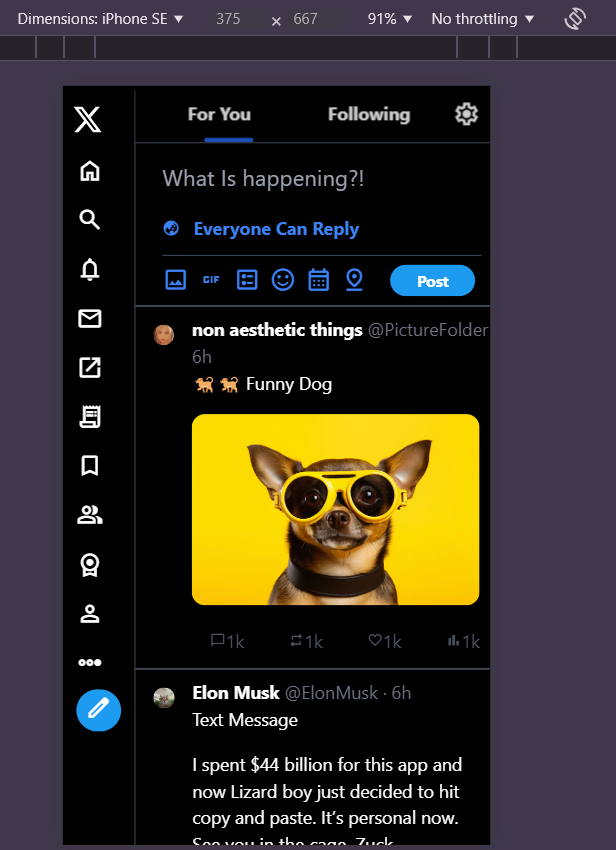
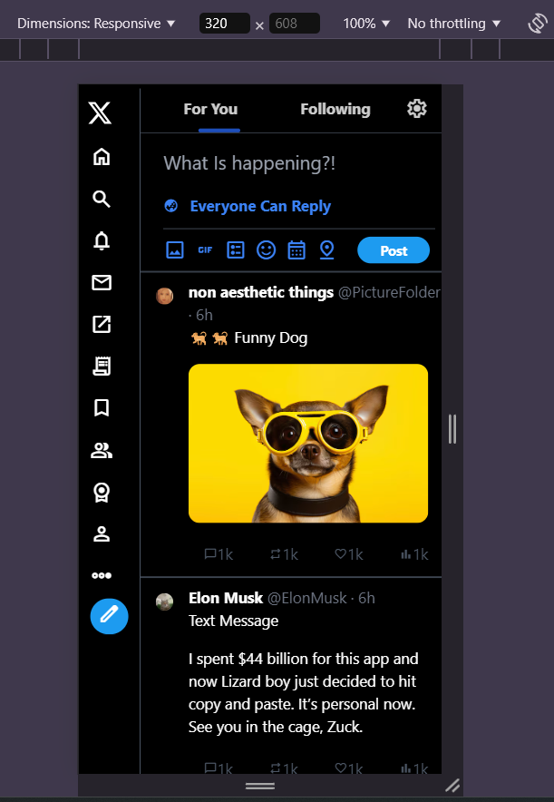
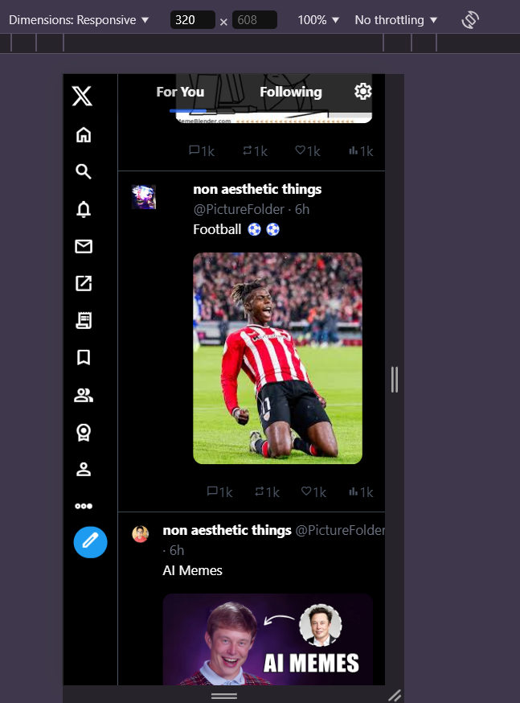

# Twitter Clone - Powered by Tailwind CSS 🚀

Welcome to **Twitter Clone**, a sleek and modern reimagining of Twitter's core functionalities, built entirely with **Tailwind CSS**. This project demonstrates a deep understanding of responsive design principles, utility-first CSS frameworks, and web development best practices.

## 🌟 Features

- **Responsive Design**: Fully optimized for all screen sizes (mobile, tablet, desktop).
- **Dark Mode**: Seamless integration of light and dark themes using Tailwind's dark mode utilities.
- **Tweet Functionality**: Users can post, like, and interact with tweets.
- **User Profiles**: Showcase user details with an intuitive layout.
- **Dynamic Feed**: Auto-updating feed for real-time updates.
- **Minimal Dependencies**: Built with only Tailwind CSS, ensuring a lightweight and fast web application.

## 🔧 Tech Stack

- **Frontend**: Tailwind CSS
- **Framework**: HTML5 with Tailwind CSS classes
- **Utility-First Styling**: Custom styles created entirely using Tailwind utilities, avoiding additional CSS files.

## ✨ Skills Demonstrated

1. **Responsive Design**: Implemented with Tailwind's flexible grid and utility classes, ensuring adaptability across devices.
2. **Component-Based Structure**: Modular and reusable components for scalability and maintainability.
3. **Utility-First Workflow**: Fully utilized Tailwind CSS to minimize custom CSS while achieving pixel-perfect designs.
4. **Dark Mode Integration**: Tailored experience for users with both light and dark mode preferences.
5. **Performance Optimization**: Lean build setup with minimal dependencies for fast loading and better SEO.

## 🚀 Getting Started

### Prerequisites

- **Node.js** installed on your machine
- Tailwind CSS installed globally (optional)

💡 Future Enhancements
- **Authentication:** User login and signup functionality.
- **Backend Integration:** Real-time database and API connection.
- **Infinite Scrolling:** Continuously load tweets as the user scrolls.

## 📸 Screenshots
#### view-1

#### view-2

#### view-3

#### view-4

#### view-5

#### view-6

#### view-7

## 🎥 Video

https://github.com/user-attachments/assets/c492425d-14c5-4ad3-8695-07245a3b1346

## 👏 Acknowledgments
This project was inspired by Twitter's UI and built to hone skills in Tailwind CSS

